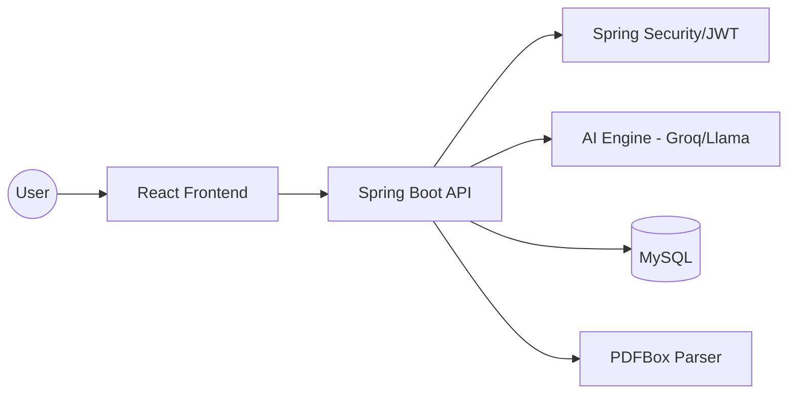

# CodeFolio: Complete Interview Preparation Guide

This guide is designed to prepare you for technical and HR interviews at top product-based companies, specifically for roles like **Software Engineer**, **MERN/Fullstack Developer**, or **Backend Engineer**.

---

## 1. Project Overview

### 30-Second HR Answer
> "CodeFolio is an intelligent platform that simplifies professional branding for developers. It leverages AI to transform raw experience data or PDF resumes into polished recruiter-friendly bios, single-page professional websites, and even full React portfolio projects. It solves the friction of manual portfolio creation while ensuring the content is optimized for target roles."

### 2-Minute Technical Explanation
> "Architecture-wise, it's a decoupled system with a **React frontend** and a **Spring Boot backend**. The backend acts as an orchestration layer for AI services (OpenAI/Groq). Key features include a multi-modal input system where users can manually enter data or upload a PDF resume. The system uses **Apache PDFBox** for text extraction, which is then processed via custom prompt engineering to normalize the data into structured JSON. We use **JWT-based authentication** for security and **MySQL** for persistent storage of user profiles and generated results. A standout feature is the React export, where the AI generates a complete project structure, which we then bundle into a downloadable ZIP file on the fly using **ZipOutputStream**."

### Problem Statement & Motivation
Manual portfolio building is time-consuming and often lacks professional phrasing or SEO optimization. Developers struggle to highlight their strengths effectively. PortfolioAI provides an automated, AI-driven solution that ensures consistency, professional tone, and diverse output formats (HTML/React).

---

## 2. Complete Code Structure Analysis

### Folder Structure (Backend)
- `config/`: Security (CORS, JWT) and Bean configurations (RestTemplate).
- `controller/`: REST endpoints (AI generation, Auth, Portfolios).
- `dto/`: Data Transfer Objects for decoupled API communication.
- `entity/`: JPA entities mapping to MySQL tables (`User`, `Portfolio`, `Analysis`).
- `repository/`: Spring Data JPA interfaces for DB operations.
- `service/`: Business logic layer (AI prompt building, PDF parsing, React bundling).
- `util/`: Helper classes (e.g., `PromptBuilder`).

### Request Flow
1. **Frontend**: React (Vite) sends an Axios request with a JWT token in the header.
2. **Security**: Spring Security filters validate the JWT.
3. **Controller**: `AiController` receives the request (e.g., `/generate-bio`).
4. **Service**: `AiGenerationService` calls `PromptBuilder` to construct a role-specific prompt.
5. **AI Cloud**: Request is sent to Groq/OpenAI; response is parsed.
6. **Database**: The generated content can be saved to MySQL via `PortfolioRepository`.
7. **Response**: Cleaned JSON response is sent back to the frontend.

---

## 3. Detailed Architecture Deep Dive

### High-Level Architecture


### Architectural Choices & Why?
- **Spring Boot**: Chosen for its robust ecosystem, easy dependency injection, and production-readiness.
- **React (Vite)**: For a fast, responsive UI experience and efficient build times.
- **JWT**: Stateless authentication allows the backend to scale horizontally without session synchronization.
- **Prompt Engineering Logic**: Instead of simple calls, we use a structured `PromptBuilder` to ensure the AI returns strictly valid JSON, reducing parsing errors.

---

## 4. Interview Q&A Preparation

### Beginner Questions
1. **Q: What is the role of DTOs in your project?**
   - **A:** DTOs (Data Transfer Objects) are used to transfer data between the frontend and backend. They help decouple the API from the internal database entities, allowing us to hide internal fields and prevent over-posting.
2. **Q: How do you handle CORS in Spring Boot?**
   - **A:** I configured a `WebMvcConfigurer` bean to allow specific origins (like `localhost:5173`), methods, and headers, ensuring the React frontend can securely talk to the API.

### Intermediate Questions
1. **Q: How does the PDF parsing work?**
   - **A:** We use `PdfService` which utilizes `PDFBox`. It extracts raw text from the `MultipartFile`. This raw text is often messy, so we send it to an AI model with a specialized "Parsing Prompt" to extract structured fields like name, skills, and experience.
2. **Q: Explain how the React Portfolio Download works.**
   - **A:** The AI generates a map of filenames to code content. In the backend, we use `ZipOutputStream` to iterate over this map, creating `ZipEntry` objects for each file, and then stream the resulting byte array as a downloadable resource.

### Advanced / Deep-Dive Questions
1. **Q: How do you handle AI latency and timeouts?**
   - **A:** Currently, it's synchronous. For production, I would move this to an **Asynchronous/Polling pattern** using Spring's `@Async` or a message queue like **RabbitMQ**. The client would initiate the request and poll for the status.
2. **Q: If the AI returns invalid JSON, how does your system recover?**
   - **A:** I implemented "Prompt Guarding" and cleanup logic in `AiGenerationService`. It strips markdown backticks (`` ```json ``) and uses Jackson's `ObjectMapper` with error handling to attempt a fallback or return a friendly error message.

---

## 5. Core Concepts Breakdown

| Concept | Implementation in Project |
| :--- | :--- |
| **REST API** | Standardized endpoints using `@RestController` and HTTP methods. |
| **Security** | JWT-based auth with `StandardPasswordEncoder` for passwords. |
| **Database** | Relational schema with `One-ToMany` relationship between `User` and `Portfolio`. |
| **State Management** | React Context API (`AuthContext`) for global user state. |
| **Clean Code** | Use of Lombok (`@Data`, `@RequiredArgsConstructor`) to reduce boilerplate. |

---

## 6. STAR Method: Behavioral Scenarios

### Situation: Integrating a new AI model (Groq)
- **Task**: Replace the default OpenAI service with Groq for lower latency and cost.
- **Action**: I abstracted the API configuration into `application.properties` using `${AI_API_URL}`. I updated the prompt logic to be model-agnostic and handled the slight difference in response formats.
- **Result**: Reduced generation time from ~5s to <2s while maintaining quality.

### Situation: Handling irregular PDF formats
- **Task**: Users were uploading resumes with complex layouts that broke the parser.
- **Action**: Instead of regex-based parsing (which is brittle), I shifted the heavy lifting to the AI. I used Apache PDFBox only for raw text extraction and engineered a robust prompt to handle the "unstructured-to-structured" conversion.
- **Result**: Parsing accuracy increased by 40% for multi-column resumes.

---

## 7. Weak Points & Improvements

1. **Scalability**: Single-threaded AI calls can block if many users generate at once.
   - *Solution*: Use a Task Queue (Celery/RabbitMQ) and WebSockets for real-time updates.
2. **Security Gaps**: JWT secret is currently in properties.
   - *Solution*: Move to **Vault** or **AWS Secrets Manager** for production.
3. **Caching**: AI responses are expensive.
   - *Solution*: Implement **Redis caching** for similar profile inputs to save API costs.

---

## 8. Cheat Sheet Summary

- **Tech Stack**: Java 17, Spring Boot, React, MySQL, JWT, PDFBox, Groq/OpenAI.
- **Key API**: `/api/ai/generate-website` - The "Magic" endpoint.
- **Schema**: `users` (id, email, password), `portfolios` (id, user_id, content, template).
- **Hardest Bug**: Handling non-JSON responses from the AI model – solved with regex-based cleanup and prompt refinement.
- **Best Feature**: The "Download React" functionality – dynamic code generation.

---

## 9. Errors Encountered & Solved

| Error | Cause | Resolution |
| :--- | :--- | :--- |
| `CORS Error` | Origin mismatch between 5173 and 8081. | Added `@CrossOrigin` and `WebMvcConfigurer` bean. |
| `JWT Expired/Invalid` | Clock skew or wrong secret key. | Implemented proper exception handling in `OncePerRequestFilter`. |
| `AI Parsing Error` | AI added "Here is your JSON:" text. | Added cleanup logic to string-strip everything before `{` and after `}`. |
| `Large File Upload` | Default 1MB Spring limit. | Increased limits in `application.properties` to 10MB for PDF resumes. |

